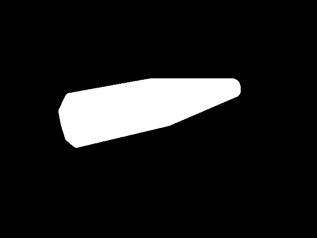
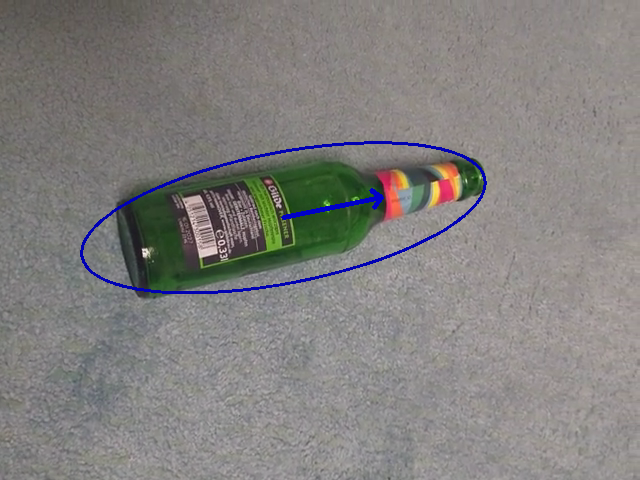

# Spin the Bottle — NAO Robot Game

A ROS package that makes an [Aldebaran/SoftBank NAO](https://en.wikipedia.org/wiki/Nao_(robot)) robot referee a game of spin-the-bottle: it watches a real bottle with its camera, works out where it's pointing once it stops spinning, turns its head to look at that spot, and asks whoever it sees to take their turn.

Originally built by **Diego Alejandro Gómez Pardo** in 2015 as a project for the Humanoid Robotics Praktikum at the University of Bonn. That original ROS (Indigo) / OpenCV package is archived on the [`nao-2015`](../../tree/nao-2015) branch, including the project report. This repo is now a personal, ongoing rework of that project: `vision_standalone/` is a from-scratch, ROS-free reimplementation of the vision pipeline, started in 2026, that ports the working ideas from the 2015 code into modern C++17/CMake so they can be developed and tested without a robot or a ROS install. `ros2_ws/` is a separate, newer piece of that rework: a ROS 2 package that drives a simulated NAO in [Webots](https://cyberbotics.com/), since neither a physical NAO nor a ROS/ROS 2-enabled one is available.

## The game

Up to 5 players sit in a half-circle facing NAO, with a bottle on the floor between them and the robot. Whoever is directly in front of NAO spins the bottle first. NAO watches it spin, and once it settles:

1. It works out which of 5 regions the bottle is pointing at.
2. It turns its head to look at that region.
3. If it sees a face there, it asks that person to spin next; if not, it asks the group to spin again.

NAO can't turn its neck through the 225°–315° arc behind it, which is exactly why the players sit in a half-circle rather than a full one.

## Ongoing and future work: `vision_standalone/`

`vision_standalone/` re-implements the vision half of the pipeline — bottle detection, movement detection, pointing-angle calculation, pixel→head-pose conversion, and face detection — as a **plain C++17/CMake project with no ROS and no catkin dependency**, so it can be built, run and unit-tested on any machine with OpenCV 4, independent of a robot or a ROS Indigo install.

| Module | Ports | Status |
|---|---|---|
| `vision_common` | Shared hue-based bottle mask + convex-hull helper, factored out so `pre_game` and `line_projection` don't duplicate it | Done |
| `pre_game` | `PreGame::BottleDetected` / `MovementDetected` | Done — reworked to threshold on **Hue** (not brightness/saturation) so detection survives lighting changes better than the 2015 version did |
| `line_projection` | `LineProjectionE::FindPointingArea` / `drawPointingLine` | Done — `find_pointing_area`, `compute_pointing_line` and `draw_pointing_line` port the `fitEllipse` + `convexHull` + `fillConvexPoly` approach from `LineProjectionE.cpp` onto the `vision_common` mask |
| `world_coordinates` | `WorldCoordinates::getWorldCoordinates` / `getPitchYawHead` | Done — `to_world_coordinates`, `find_target_point` and `compute_head_pose`, including the 5-region head-yaw snapping from the original |
| `face_detection` | `DetectFace::detectAndDisplay` | Done — `load_model`/`detect_face` run YuNet (an ONNX face-detection model from the OpenCV Zoo, at `data/face_detection_yunet_2023mar.onnx`) on the frame's central half, via a hand-written decode of its raw outputs rather than `cv::FaceDetectorYN` (see `face_detection.h` for why). Originally a Haar cascade, like the 2015 code, but that was confirmed to false-positive on a dog's face during real-footage testing - see the git history around the `data/faces_examples/` videos for that finding |

`src/main.cpp` is a throwaway harness that runs the whole pipeline end-to-end, either against a synthetic frame (a colored ellipse standing in for a real NAO camera frame) or, if given a video file path as its first argument, against real recorded frames via `cv::VideoCapture` — printing each stage's output per frame and writing out `saturation_mask.png` / `pointing_line.png` for a visual sanity check. Below is that output from a real recorded frame (`data/bottle_examples/`), not the synthetic ellipse:

| `saturation_mask.png` | `pointing_line.png` |
|---|---|
|  |  |

`pre_game`, `line_projection`, `world_coordinates` and `face_detection` each also have a dedicated test binary under `tests/`, wired into `ctest`:

- **`world_coordinates_tests`** — checks against values worked out by hand from the underlying geometry (line/circle intersection, angle bucketing), independent of the image pipeline.
- **`line_projection_tests`** — checks against synthetic shapes with known geometry (an asymmetric "bottle" silhouette, a rotated ellipse), with looser tolerances since `fitEllipse`'s output isn't something derivable by hand.
- **`pre_game_tests`** — checks `bottle_detected`'s threshold buckets against synthetic frames with known bottle-pixel counts, and `movement_detected`'s diff-threshold logic against identical vs. shifted frames. `BottleState::FullFrame` isn't covered: `threshold_mask` always zeroes out a border band, so a mask covering 100% of the frame can't actually happen through the public API.
- **`face_detection_tests`** — checks `load_model`'s success/failure return value against a missing file and the real checked-in YuNet model, and checks that `detect_face` returns `nullopt` both with no model loaded and against a blank frame. It also runs against real recorded footage in `data/faces_examples/`: a synthetic AI-generated human face ([thispersondoesnotexist.com](https://thispersondoesnotexist.com/)), a dog, and an empty background ("Small cacti with a white wall background" via [rawpixel.com](https://www.rawpixel.com/)) — confirming a real face is found, that an empty background isn't a false positive, and that a dog's face isn't mistaken for a human one (the Haar cascade this replaced failed that last check).

`vision_common` doesn't have its own test binary — it's exercised indirectly through the `pre_game` and `line_projection` tests.

```bash
cd vision_standalone
mkdir -p build && cd build
cmake ..
cmake --build .
./vision_standalone              # runs the synthetic-frame harness
./vision_standalone path/to.mp4  # runs the pipeline against a real video file instead
ctest                             # runs pre_game_tests, line_projection_tests, world_coordinates_tests and face_detection_tests
```

The bottle-color hue band in `vision_common.cpp` (`kBottleHueLow`/`kBottleHueHigh`) is calibrated for a green bottle, matching the wine/Sprite bottle the original project used — recalibrate it if you use a different colored bottle.

### Future work

1. **Re-integrate with ROS** — started in `ros2_ws/` below: NAO's head movement and the full pointing/face-check decision are all driven through ROS 2 now, against recorded footage rather than a live/simulated camera.

## Ongoing and future work: `ros2_ws/`

`ros2_ws/` is a ROS 2 (Jazzy) workspace that drives a simulated NAO in Webots, standing in for the physical robot the 2015 project needed. Scope is deliberately staged, starting with body movement only:

- **`nao_webots_driver`** (done) — no simulated camera; NAO's "vision" is `vision_standalone`'s recorded footage (see above), not a Webots camera feed, which keeps the simulation light. `HeadYaw`/`HeadPitch`, both shoulders (`L`/`RShoulderPitch`, `L`/`RShoulderRoll`) and both elbows (`L`/`RElbowYaw`, `L`/`RElbowRoll`) are driven through `ros2_control` (`joint_trajectory_controller`s: `head_controller`, `arm_controller`), confirmed working end-to-end against a `nao_ros2.wbt` world (adapted from Webots' `nao_demo`, with NAO's controller set to `<extern>`). NAO's head and shoulder joints are modeled in Webots' `Nao.proto` as `Hinge2Joint` (2 degrees of freedom in one joint), which Webots can't auto-export to URDF, so `resource/nao_webots.urdf` is a hand-written joint chain (using NAO's real joint limits) published via a plain `robot_state_publisher` node, rather than relying on Webots' auto-export.
- **`nao_vision_referee`** (done) — a `referee_node` that compiles `vision_standalone`'s `pre_game`/`line_projection`/`world_coordinates`/`face_detection` sources directly (no duplication), and plays a simulated game of a few rounds (3 by default). Each round: NAO looks down and waits for a randomly picked recorded bottle-spin video (one of all 6 `data/bottle_examples/` recordings, so every region and the dead zone all come up over enough rounds) to settle in real time - frame reads are paced to the video's own frame rate, so this genuinely takes as long as the recording does, not a precomputed/faked wait. If that lands on a valid target, NAO turns its head (level, not tilted down - `vision_standalone`'s real pitch is calibrated for aiming a camera, not for how this looks) and points with whichever arm is on that side (shoulder up, elbow straightened; not derived from `vision_standalone`, this is robot-arm kinematics), then checks a randomly picked recorded face video (one real face, one dog, one empty background) for a face. Either way - no valid target, or no face found - NAO resets to a neutral head and opens both arms in a "confused" gesture instead. Between rounds it waits a random 3-5 seconds. The face check reads a recorded video rather than a live/simulated camera frame, same as everything else here — it's there to test the ROS 2 wiring, not to be the final input source. The arm-pose math (`robot_gesture`) and real-footage decisions (`settle_watcher`) live in their own header/src pairs so `referee_logic_tests` can exercise them (against all 6 real bottle videos and all 3 real face videos) without a running ROS graph, wired into `ctest` the same way as `vision_standalone`'s own tests.

### Future work

1. Swap the recorded-video face check for a real or simulated camera feed of what NAO would actually see after turning its head - deliberately deferred so far, since a simulated camera reintroduces GPU-rendering load this project has otherwise avoided to stay stable on WSL2/WSLg.

### Known limitation: no NAO speech

There's no way for the simulated NAO to actually speak. Webots' `Nao.proto` doesn't define a Speaker device at all, so unlike the camera/joints there's nothing here for even a custom `webots_ros2_driver` plugin to control - it's not a missing-integration problem, the simulated hardware itself doesn't exist. Any "NAO says X" behavior would have to be text-only (e.g. a logged/published phrase) or a real TTS engine speaking on the host machine, entirely separate from the Webots simulation.

## Repository layout

```
vision_standalone/                    ROS-free modern rework (2026-)
├── include/                          pre_game.h, line_projection.h, world_coordinates.h, vision_common.h, face_detection.h
├── src/                              implementations + throwaway test harness (main.cpp)
├── tests/                            pre_game_tests.cpp, line_projection_tests.cpp, world_coordinates_tests.cpp, face_detection_tests.cpp (wired into ctest)
├── data/                             face_detection_yunet_2023mar.onnx (model used by face_detection)
│   ├── bottle_examples/              real recorded bottle-spin videos, for use with ./vision_standalone path/to.mp4
│   └── faces_examples/               real face/dog/background videos, used by face_detection_tests
└── CMakeLists.txt

ros2_ws/                              ROS 2 (Jazzy) + Webots rework (2026-)
└── src/
    ├── nao_webots_driver/            drives a simulated NAO's head via ros2_control
    │   ├── launch/robot_launch.py    launches Webots + the ros2_control bridge
    │   ├── resource/                 nao_webots.urdf, ros2_control.yml
    │   └── worlds/nao_ros2.wbt       Webots world (NAO set to an <extern> controller)
    └── nao_vision_referee/           plays the simulated game - randomized rounds, points, checks for a face
        ├── include/                  robot_gesture.h, settle_watcher.h
        ├── src/                      referee_node.cpp + robot_gesture.cpp, settle_watcher.cpp (compiles vision_standalone's sources in directly)
        └── tests/referee_logic_tests.cpp  wired into ctest, against all 6 bottle + 3 face videos
```